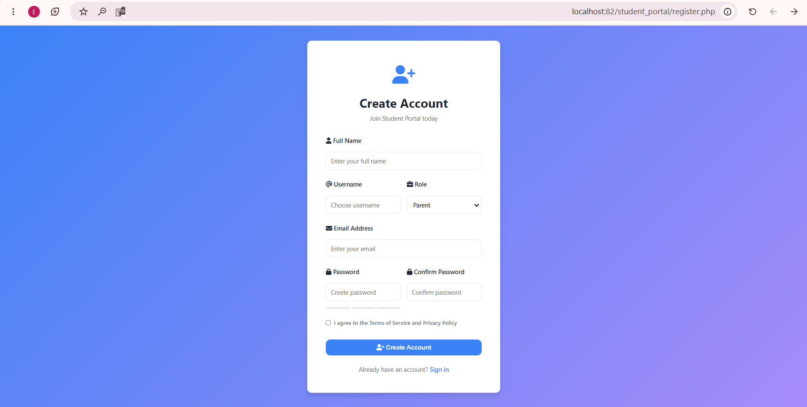
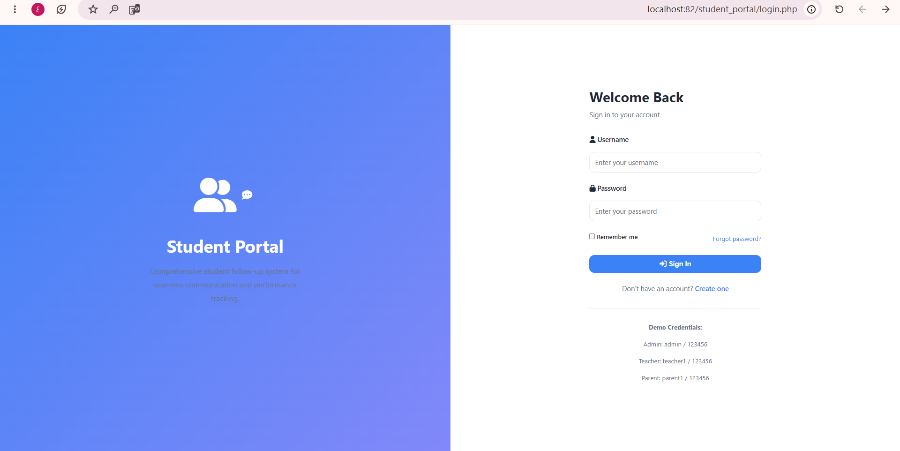
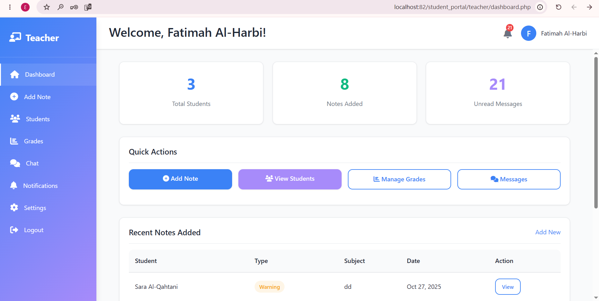
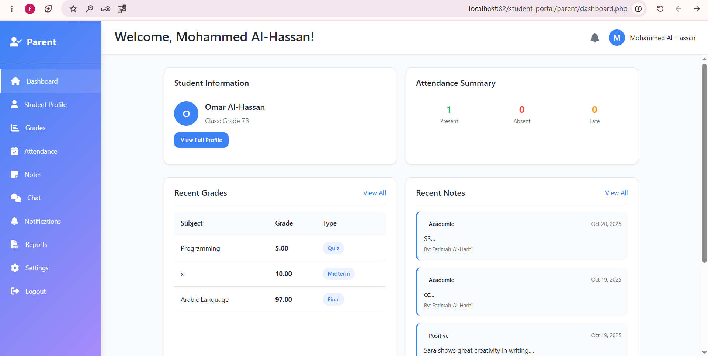

# Student Portal - Comprehensive Student Follow-up System

A modern, responsive web application for managing student information, communication, and performance tracking.

## Features

### Core Functionality
- **Student Electronic Profile**: Complete student information including academic, behavioral, health, and special circumstances data
- **Notes & Notifications System**: Teachers can add notes with instant notifications to guardians
- **Direct Communication**: Secure messaging between parents, teachers, and counselors
- **Reports & Statistics**: Comprehensive performance reports and analytics
- **Role-Based Access Control**: Different dashboards for parents, teachers, counselors, and administrators

### User Roles
1. **Parent/Guardian**: View student profile, grades, attendance, notes, and communicate with teachers
2. **Teacher**: Add notes, manage grades, view student information, and communicate with parents
3. **Counselor**: Access full student files including special circumstances, manage counseling sessions
4. **Administrator**: System management, user management, and analytics

## Technology Stack

- **Frontend**: HTML5, CSS3, JavaScript
- **Backend**: PHP 7.4+
- **Database**: MySQL 5.7+
- **UI Components**: FontAwesome Icons, Chart.js for analytics
- **Design**: Modern, responsive design with calm colors (blue, purple, gray)

## Installation & Setup

### Prerequisites
- PHP 7.4 or higher
- MySQL 5.7 or higher
- Web server (Apache/Nginx)

### Installation Steps

1. **Extract the project files** to your web server root directory

2. **Create a MySQL database**:
   ```sql
   CREATE DATABASE student_portal;
   ```

3. **Configure database connection**:
   - Edit `includes/db_config.php`
   - Update database credentials:
     ```php
     define('DB_HOST', 'localhost');
     define('DB_USER', 'root');
     define('DB_PASS', '');
     define('DB_NAME', 'student_portal');
     ```

4. **Access the application**:
   - Navigate to `http://localhost/student_portal/`
   - Tables will be created automatically on first access

## Demo Credentials

### Admin Account
- **Username**: admin
- **Password**: 123456

### Teacher Account
- **Username**: teacher1
- **Password**: 123456

### Parent Account
- **Username**: parent1
- **Password**: 123456

## Project Structure

```
student_portal/
├── assets/
│   ├── css/
│   │   └── style.css          # Main stylesheet
│   ├── js/
│   │   └── main.js            # Main JavaScript
│   ├── images/                # Image assets
│   └── fonts/                 # Font files
├── includes/
│   ├── db_config.php          # Database configuration
│   └── functions.php          # Helper functions
├── parent/
│   ├── dashboard.php          # Parent dashboard
│   ├── profile.php            # Student profile
│   ├── grades.php             # Grades view
│   ├── attendance.php         # Attendance records
│   ├── notes.php              # Notes view
│   ├── chat.php               # Messaging
│   ├── notifications.php      # Notifications
│   ├── reports.php            # Performance reports
│   └── settings.php           # User settings
├── teacher/
│   ├── dashboard.php          # Teacher dashboard
│   ├── add_note.php           # Add notes
│   ├── students.php           # Student list
│   ├── grades.php             # Grade management
│   ├── chat.php               # Messaging
│   ├── notifications.php      # Notifications
│   └── settings.php           # Settings
├── counselor/
│   └── dashboard.php          # Counselor dashboard
├── admin/
│   └── dashboard.php          # Admin dashboard
├── index.php                  # Landing page
├── login.php                  # Login page
├── register.php               # Registration page
├── logout.php                 # Logout handler
└── README.md                  # This file
```

## Key Pages & Features

### Landing Page (`index.php`)
- Welcome screen with system overview
- Login and registration buttons
- Feature highlights

### Login (`login.php`)
- Secure authentication
- Role-based redirect
- Demo credentials available

### Parent Dashboard
- Student overview card
- Attendance summary
- Recent grades and notes
- Quick action buttons

### Student Profile (`parent/profile.php`)
- Tabbed interface for different aspects
- Academic performance
- Behavioral records
- Attendance history
- Health information

### Grades Management
- View grades by subject
- Average calculations
- Performance visualization
- Print/export functionality

### Attendance Tracking
- Attendance statistics
- Visual charts
- Detailed records
- Attendance percentage

### Notes & Observations
- Categorized notes (academic, behavioral, positive, warning)
- Filter by type
- Teacher attribution
- Reply functionality

### Direct Communication
- Real-time messaging
- Contact list
- Message history
- File sharing support

### Reports & Analytics
- Comprehensive performance reports
- Chart visualizations
- Export to CSV
- Print functionality

## Database Schema

### Main Tables
- `users`: User accounts and authentication
- `students`: Student information
- `guardians`: Parent/guardian information
- `teachers`: Teacher details
- `grades`: Academic grades
- `attendance`: Attendance records
- `notes`: Teacher notes and observations
- `messages`: Direct messaging
- `notifications`: System notifications
- `counseling_sessions`: Counselor session records
- `special_circumstances`: Confidential student information
- `announcements`: Class announcements

## Security Features

- Password hashing with bcrypt
- SQL injection prevention with prepared statements
- Session-based authentication
- Role-based access control
- Data validation and sanitization
- Secure messaging system


### Branding
- Update logo in sidebar
- Customize school name
- Modify color scheme

## API Endpoints

The system includes several PHP endpoints for AJAX operations:
- `includes/send_message.php` - Send messages
- `includes/get_notifications.php` - Fetch notifications

## Performance Optimization

- Responsive design for all devices
- Optimized database queries
- CSS/JS minification ready
- Lazy loading support
- Chart.js for efficient data visualization

## Browser Support

- Chrome 90+
- Firefox 88+
- Safari 14+
- Edge 90+

## Troubleshooting

### Database Connection Error
- Verify MySQL is running
- Check database credentials in `db_config.php`
- Ensure database exists

### Login Issues
- Clear browser cache
- Check session settings
- Verify user exists in database

### Missing Pages
- Ensure all files are extracted
- Check file permissions
- Verify web server configuration

## Future Enhancements

- Mobile app integration
- SMS notifications
- Video conferencing
- Advanced analytics
- Parent portal mobile app
- Integration with school management systems

## Support & Documentation

For detailed documentation and support, refer to:
- System requirements
- Installation guide
- User manual
- API documentation

## License

This project is provided as-is for educational and institutional use.

##Screenshots

### Register


### Login


### ‪Teacher-Dashboard


### Parent-Dashboard



